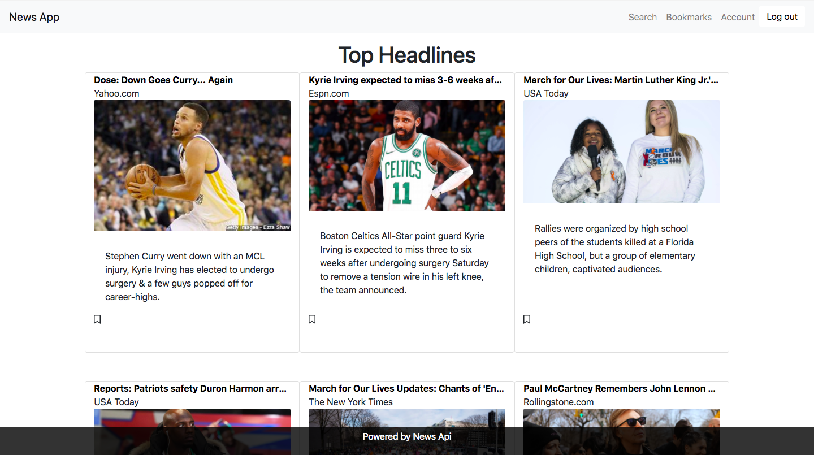

# News App

A rails app that allows you to view the latest articles from the NewsApi. You can sign in to bookmark an article. 

## Installation Instructions

- Fork / clone this repository.
- cd into the downloaded directory.
- Install dependencies
  - `bundle install`
- Create database and run migrations.
  - `rails db:create && rails db:migrate`  
- Start server 
  - `rails server`

## Technologies Used
- Ruby
- Ruby on Rails
- HTML
- CSS
- JS
- [News Api](https://newsapi.org/)
